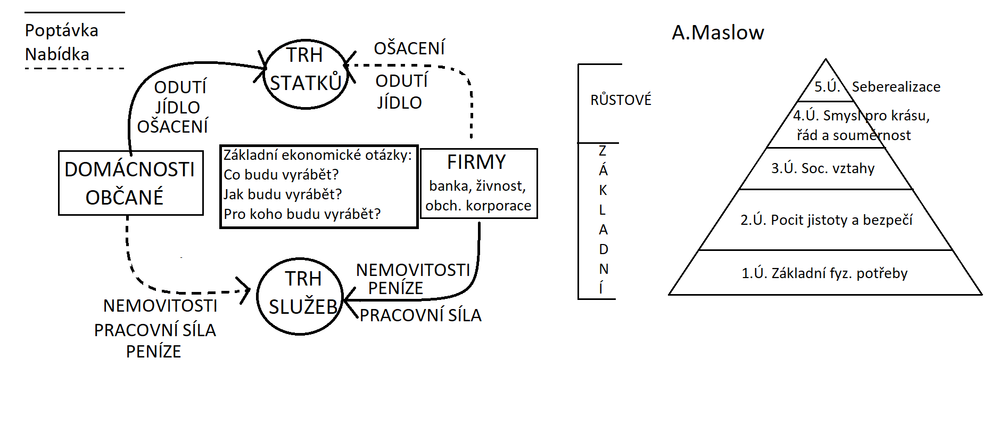
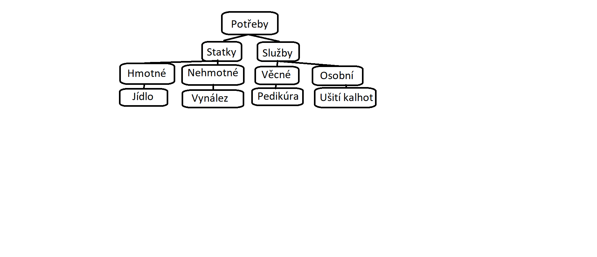

# Ekonomie

> Ezistence společenská věda, která se opírá o mnoho dalších vědních disciplín (psychologie, matematika, finanční gramotnost, sociologie, legislativa).

## Základní pojmy

| Pojem       | Znamená                                  |
| ----------- | ---------------------------------------- |
| **Ekonomie**  | teorie                                   |
| **Ekonomika** | praxe                                    |

- **Mikroekonomie** = ekonomika menšího celku (firma, domácnost …)
- **Makroekonomie** = ekonomika celého státu (národní hospodářství)

## Potřeby

Potřeba = pociťovaný nedostatek, který uspokojujeme nákupem statků a služeb.

Při přechodu z jedné motivační úrovně do druhé musí být na 100 % naplněný potřeby nižší úrovně.

## Peníze

Peníze = ekvivalent, za který si můžeme něco koupit.

> Dnes: mince, bankovky, bezhotovostní peníze, virtuální peníze.

Funkce peněz = prostředek směny.

### Ochranné prvky bankovek

1. Vodoznak
2. Kovový proužek
3. Oranžový proužek
4. Skrytý obrazec
5. Soutisková značka
6. Mikrotext
7. Opticky proměnlivá barva
8. Duhový pruh

## Hospodářský proces

Subjekty na trzích vyrábějí statky a služby, k tomu potřebují výrobní faktory:

1. Pracovní síla
2. 
3. Kapitál
4. Informace

### 4 kroky hospodářského procesu

1. **Výroba**
2. **Rozdělování a přerozdělování** (odvody)
3. **Směna** (ekvivalent peníze)
4. **Spotřeba** – výrobní a osobní (jednotlivec)

### Rozdělování vs. přerozdělování

- **Rozdělování:** mzda (riziko)
- **Rozdělování:** mzda (riziko)
- **Přerozdělování:** odvody / daně, SP (sociální pojištění) a ZP (zdravotní pojištění) => zákonem dané odvody

#### Příklad výpočtu čisté mzdy

HM (hrubá mzda) = 20 000,-
Daň = 15 % = 3 000,-
SP (sociální pojištění) = 6,5 % = 1 300,-
ZP (zdravotní pojištění) = 4,5 % = 900,-
**Zbytek = 17 470,-**

## Ekonomické systémy

Ekonomický systém je založen na potřebách, které uspokojujeme nákupem statků a služeb. Statky + služby = **zboží**.

1. **Zvykový** (v kmenech, dneska v Africe)
2. **Příkazový** (centrálně plánovaný)
3. **Tržní** -> zákon poptávky a nabídky

### Zákony poptávky a nabídky

- **Zákon poptávky:** S rostoucí cenou klesá poptávka po zboží.
- **Zákon nabídky:** S rostoucí cenou roste nabízené množství zboží.

## Bezpečnostní prvky platebních karet

### Fyzické bezpečnostní prvky

1. **3D hologram**
   - Visa: holubice
   - Mastercard: globe
2. **Všechna písmena a čísla jsou vystouplá**
3. **UV tisk**
4. **Magnetický proužek** (ze staré doby, moc se už nepoužívá)
5. **EMV mikročip**
6. **CVV/CVC kód**
7. **Podpisový proužek**
8. **Dynamický CVV**

### Digitální bezpečnostní vrstvy

1. **2FA** (heslo, PIN, fyzické vlastnictví)
2. **Tokenizace biometrie**

## Úroveň národního hospodářství

1. Politický a ekonomický systém ve vládě
2. Demografie, obyvatelstvo
3. Úroveň vzdělanosti
4. Přírodní zdroje
5. Národní bohatství

## Státní rozpočet

### Příjem

- Daně (z příjmu, z nemovitosti, spotřební, z převodu, silniční, z hazardu, energetické, poplatky atd.)
- Clo
- Sociální pojištění
- Příjmy z EU

### Výdaj

TODO
